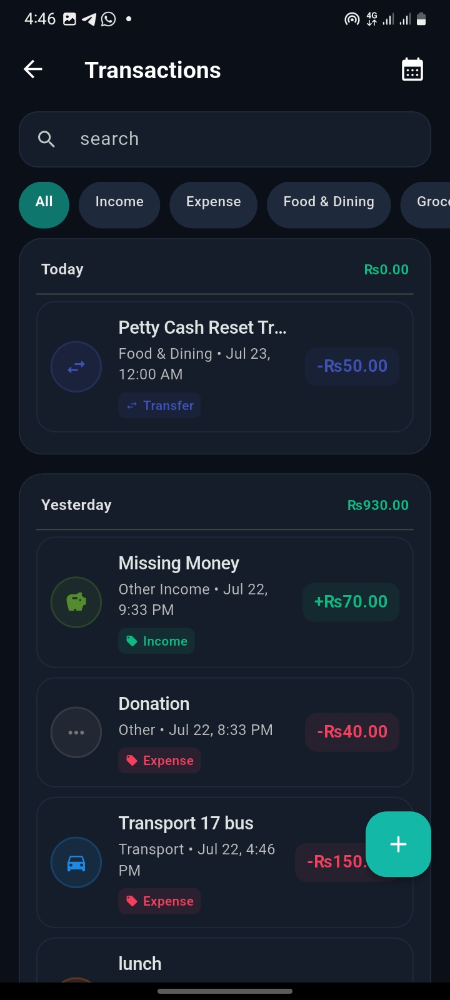
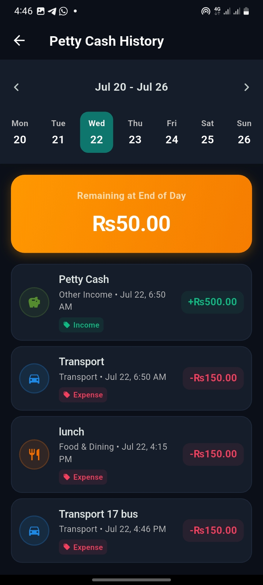
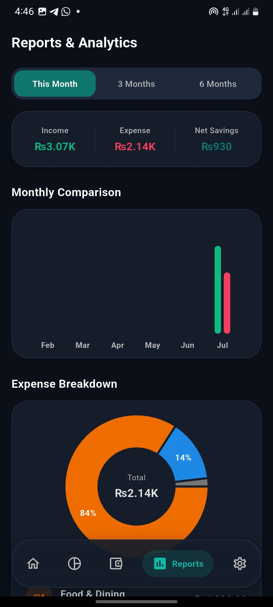
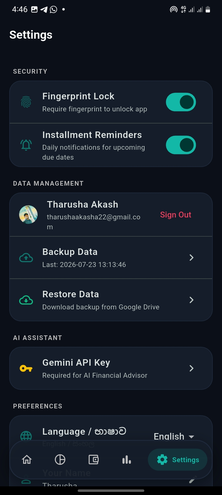
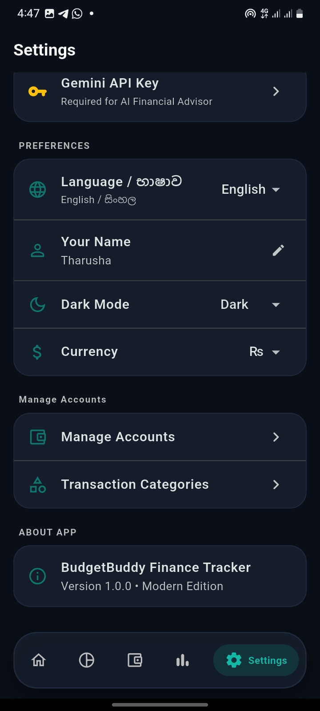
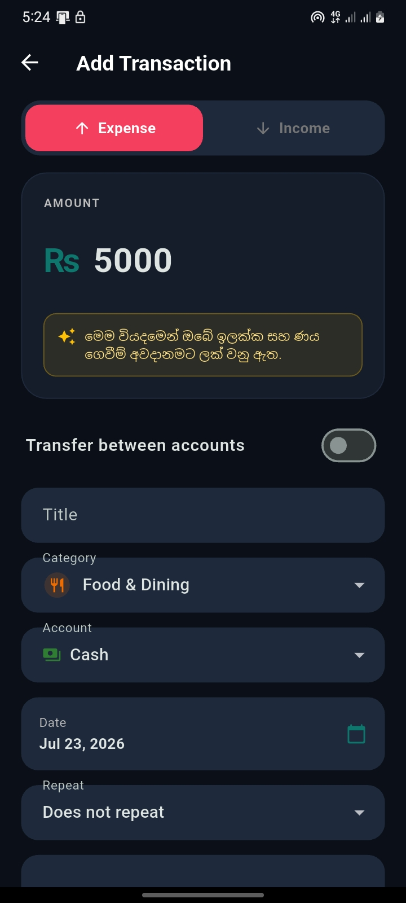

# 💸 BudgetBuddy (Finance Tracker)


A modern, full-featured, and highly intelligent personal finance management application built with **Flutter**. Keep track of your daily expenses, monitor your financial goals, manage installments, and receive personalized financial advice powered by OpenRouter AI.

---

### 📥 Download the App!
Ready to take control of your finances?
👉 **[Download the latest APK release here](../../releases)** 👈
*(Head over to the Releases tab on GitHub to download and install the app on your Android device)*

---

## 🚀 Key Features

*   🤖 **AI Financial Advisor (Powered by OpenRouter):** Get real-time advice on whether you should make a purchase based on your current budget, or how much you should save to reach your goals.
*   💳 **Interactive Swipeable Dashboard Cards:** View your **Total Net Worth**, **Main Bank Total**, and **Cash Reserves** through beautifully designed, swipeable glassmorphic cards equipped with realistic EMV chips.
*   🔒 **Biometric Security:** Keep your financial data safe with built-in fingerprint and face unlock capabilities.
*   🌍 **Bilingual Support:** Fully translated into **English** and **Sinhala** for local users.
*   🌗 **Dark/Light Mode:** Automatically adapts to your system theme with carefully crafted colors and glassmorphic elements.
*   📊 **Comprehensive Financial Tracking:** Track petty cash, loans/installments, recurring transactions, and custom categories.
*   ☁️ **Google Drive Backup:** Sync and backup your local financial data securely to your Google Drive.
*   📱 **SMS Bank Integration:** Automatically reads and categorizes SMS transaction alerts from your bank.

---

## 📸 Screenshots

Here is a glimpse of BudgetBuddy in action:

<div style="display: flex; flex-wrap: wrap; gap: 10px;">
  
  
  
  
  
  
  
</div>

---

## 🛠️ Project Structure

```text
lib/
  models/          # Data structures for Transactions, Goals, Installments, etc.
  providers/       # State management and local persistence (SharedPreferences)
  screens/         # UI Screens (Dashboard, Biometric Lock, AI Settings, etc.)
  services/        # OpenRouter AI integration, Google Drive backup, SMS listener
  widgets/         # Reusable glassmorphic UI components
  utils/           # Localization (Sinhala/Eng), Themes, and Formatters
main.dart          # Entry point
```

## ⚙️ How to Build & Run

1.  Make sure you have the [Flutter SDK](https://docs.flutter.dev/get-started/install) installed.
2.  Clone the repository and open the terminal in the root directory.
3.  Run the following commands:
    ```bash
    flutter pub get
    flutter run
    ```
4.  To build an APK for Android:
    ```bash
    flutter build apk
    ```

---
*Built with ❤️ using Flutter & Dart.*
