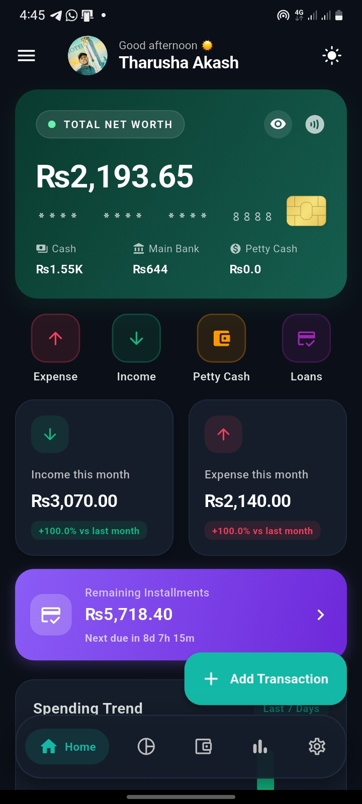

# 💸 BudgetBuddy (Finance Tracker)


A modern, full-featured, and highly intelligent personal finance management application built with **Flutter**. Keep track of your daily expenses, monitor your financial goals, manage installments, and receive personalized financial advice powered by OpenRouter AI.


---

### 📥 Download the App!

Ready to take control of your finances?

👉 **[Download the latest APK release here](../../releases)** 👈

*(Head over to the Releases tab on GitHub to download and install the app on your Android device)*

---

## 🚀 Key Features

- 🤖 **AI Financial Advisor (Powered by OpenRouter):** Ask whether you should make a purchase, how to cut costs, or how much you need to save to hit a goal — and get real, context-aware advice based on your actual balances and spending habits, rendered with rich Markdown formatting.
- 💳 **Interactive Swipeable Dashboard Cards:** View your **Total Net Worth**, **Main Bank Total**, and **Cash Reserves** through beautifully designed, swipeable glassmorphic cards equipped with realistic EMV chips.
- 📈 **Visual Analytics & Charts:** Interactive pie charts and trend graphs (powered by `fl_chart`) that break down your spending by category, so you can spot exactly where your money is going at a glance.
- 🔒 **Biometric Security:** Keep your financial data safe with built-in fingerprint and face unlock, so only you can open the app.
- 🌍 **Bilingual Support:** Fully translated into **English** and **Sinhala**, with a one-tap language switch for local users.
- 🌗 **Dark/Light Mode:** Automatically adapts to your system theme with carefully crafted colors and glassmorphic elements.
- 📊 **Comprehensive Financial Tracking:** Track petty cash, loans/installments, recurring transactions, and fully custom categories.
- 🔁 **Recurring Transactions & Reminders:** Set up recurring bills and subscriptions, with background scheduling (via `workmanager`) so reminders fire even when the app isn't open.
- 🎯 **Financial Goals Tracker:** Set savings targets, track progress visually, and let the AI advisor tell you how much you need to set aside each month to reach them on time.
- 📆 **Installment & Loan Manager:** Log installment plans and loans, track remaining balances, and never miss a due date with built-in notifications.
- ☁️ **Google Drive Backup & Sync:** Securely back up and restore your local financial data to your own Google Drive account, using Google Sign-In.
- 📱 **SMS Bank Integration:** Automatically reads and parses incoming SMS transaction alerts from your bank, categorizing them into your ledger without manual entry.
- 🔔 **Smart Local Notifications:** Timezone-aware push notifications for bill due dates, recurring transactions, and budget alerts.
- 🔐 **Local-First Storage:** All your financial data stays on your device by default (via `shared_preferences`), with cloud backup as an optional, user-controlled feature.

---

## 📸 Screenshots

Here is a glimpse of BudgetBuddy in action:

<div style="display: flex; flex-wrap: wrap; gap: 10px;">



</div>

---

## 🧰 Tech Stack

| Category | Technology |
|---|---|
| **Framework** | Flutter (Dart >=3.0.0) |
| **State Management** | Provider |
| **Local Storage** | Shared Preferences |
| **Charts & Visualization** | fl_chart |
| **AI Integration** | OpenRouter AI (via HTTP) |
| **Authentication** | local_auth (Biometrics), Google Sign-In |
| **Cloud Backup** | Google Drive API (googleapis) |
| **Notifications** | flutter_local_notifications, timezone |
| **Background Tasks** | workmanager |
| **SMS Parsing** | readsms, flutter_sms_inbox, permission_handler |
| **Markdown Rendering** | flutter_markdown |
| **Utilities** | intl, uuid |

---

## 🛠️ Project Structure

```text
lib/
  models/          # Data structures for Transactions, Goals, Installments, etc.
  providers/       # State management and local persistence (SharedPreferences)
  screens/         # UI Screens (Dashboard, Biometric Lock, AI Settings, etc.)
  services/        # OpenRouter AI integration, Google Drive backup, SMS listener
  widgets/         # Reusable glassmorphic UI components
  utils/           # Localization (Sinhala/Eng), Themes, and Formatters
main.dart          # Entry point
```

---

## ⚙️ How to Build & Run

1. Make sure you have the [Flutter SDK](https://docs.flutter.dev/get-started/install) installed (Dart SDK >=3.0.0).
2. Clone the repository and open the terminal in the root directory:
   ```bash
   git clone https://github.com/TharushaAkash/BudgetBuddy.git
   cd BudgetBuddy
   ```
3. Install dependencies:
   ```bash
   flutter pub get
   ```
4. Run the app on a connected device or emulator:
   ```bash
   flutter run
   ```
5. To build a release APK for Android:
   ```bash
   flutter build apk --release
   ```

### 🔑 Configuration Notes

- **AI Advisor:** Requires an [OpenRouter](https://openrouter.ai/) API key, configured in-app under AI Settings.
- **SMS Integration:** Requires SMS read permissions on Android; grant these when prompted for automatic transaction detection.
- **Google Drive Backup:** Requires signing in with a Google account from within the app's Settings screen.
- **Biometric Lock:** Uses the device's native fingerprint/face unlock; no extra setup needed beyond enabling it in your phone's settings.

---

## 🗺️ Roadmap

- [ ] Multi-currency support
- [ ] Budget limit alerts per category
- [ ] Export reports to PDF/Excel
- [ ] iOS release
- [ ] Widget support for home screen balance view

---

## 🤝 Contributing

Contributions, issues, and feature requests are welcome! Feel free to check the [issues page](../../issues) or open a pull request.

---

## 📄 License

This project is licensed under the MIT License.

---

*Built with ❤️ using Flutter & Dart.*
